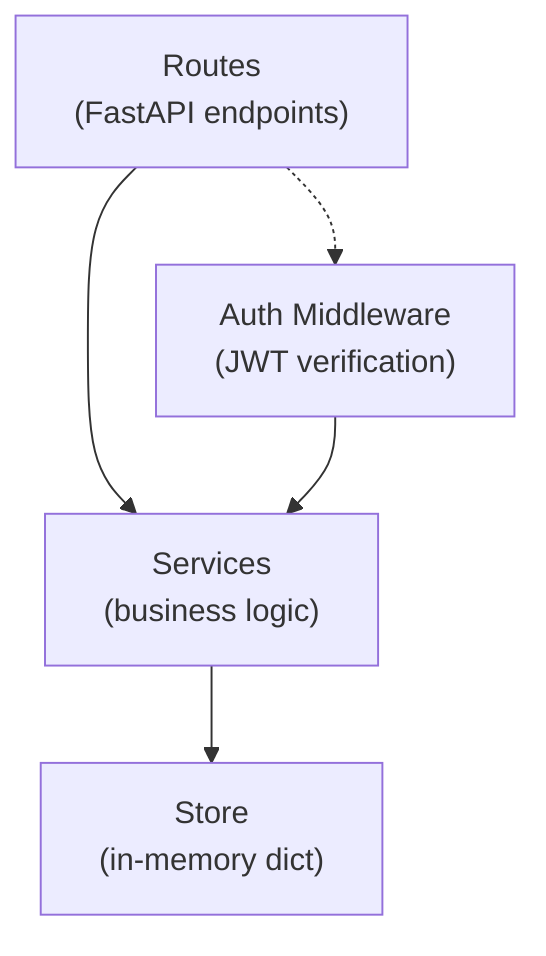

# Architecture Spine — Simple REST API Auth

## Design Paradigm

**Layered** — three tiers, each calling only the one below:



- **Routes** — HTTP contract: request parsing, response shaping, status codes. No business logic.
- **Services** — auth logic: registration, login, token creation, credential verification. Owns the rules.
- **Store** — thin data-access layer over a Python dict. No logic, no validation.

## Invariants & Rules

### AD-1 — Stateless Auth

- **Binds:** all endpoints, auth middleware
- **Prevents:** server-side session state that couples requests to a process
- **Rule:** All authentication state is carried in the JWT. No session cookies, no server-side session store. The `GET /me` endpoint extracts identity from the token alone.

### AD-2 — Passwords Never in Plaintext

- **Binds:** `POST /register`, `POST /login`, `POST /change-password`, services layer
- **Prevents:** plaintext credential storage, leakage in responses/logs, double-hashing
- **Rule:** Passwords are hashed with bcrypt (default work factor) in `services.py` — exactly one layer. The hash must be a Python `str` (not `bytes`); call `.decode('utf-8')` before insertion. The store layer never sees or transforms plaintext passwords and never re-hashes. No endpoint response ever includes a password field. For password change: the current password is verified against the stored hash, then the new password is hashed and stored — all in `services.py`.

### AD-3 — Single In-Memory Store

- **Binds:** all endpoints
- **Prevents:** hidden persistence assumptions, mixed storage backends
- **Rule:** One Python dict keyed by username holds all user data for the process lifetime. No database, no file I/O, no external state. Data is lost on restart — this is intentional.

### AD-4 — JWT as Sole Auth Mechanism

- **Binds:** `GET /me`, `POST /change-password`, auth middleware
- **Prevents:** mixed auth strategies (cookies + tokens + API keys)
- **Rule:** A signed JWT in the `Authorization: Bearer <token>` header is the only way to authenticate. No refresh tokens, no token rotation, no refresh endpoint. The JWT remains valid after a password change — no token invalidation on credential update.

### AD-5 — Consistent Error Shape

- **Binds:** all endpoints
- **Prevents:** ad-hoc error responses across units
- **Rule:** Errors return a JSON body with a `detail` field (always a `str`, never a list). HTTP status codes follow REST convention: `400` for bad input (including weak password), `401` for unauthenticated or wrong current password, `409` for conflict. Custom error handler overrides FastAPI's default `422` validation errors to use the same `{"detail": str}` shape.

## Consistency Conventions

| Concern | Convention |
| --- | --- |
| Entity naming | `User` model with fields: `username` (str, unique key), `name` (str), `password_hash` (str, never exposed) |
| API responses | Success: JSON with relevant fields. Error: `{"detail": "message"}` |
| JWT claims | `sub` = username (lowercased), `exp` = 24h from issuance |
| HTTP methods | `POST` for create/authenticate/mutate, `GET` for read. No `PUT`/`PATCH`/`DELETE` in scope |
| Status codes | `201` on register, `200` on login/me/change-password, `400` bad input, `401` unauthenticated/wrong password, `409` duplicate |
| Username keys | Always lowercased on write; all lookups use lowercased form |
| Register response | `{"access_token": str, "token_type": "bearer"}` |
| Login response | `{"access_token": str, "token_type": "bearer"}` |
| Me response | `{"username": str, "name": str}` |
| Change password request | `{"current_password": str, "new_password": str}` |
| Change password response | `{"message": "Password changed successfully"}` |

## Stack

| Name | Version | Role |
| --- | --- | --- |
| Python | ≥ 3.10 | Language runtime |
| FastAPI | 0.141.1 | Web framework |
| Uvicorn | 0.52.4 | ASGI server |
| bcrypt | 5.0.0 | Password hashing |
| PyJWT | 2.13.0 | JWT encode/decode |
| Pydantic | (via FastAPI) | Request/response validation |

## Structural Seed

```text
src/
  main.py          # app factory, route registration, startup
  routes.py         # /register, /login, /me, /change-password endpoint handlers
  services.py       # register_user, authenticate, get_current_user, change_password logic
  store.py          # in-memory user dict + helpers (add_user, get_user, update_password)
  models.py         # Pydantic request/response models (RegisterRequest, LoginRequest, ChangePasswordRequest, ...)
  auth.py           # JWT creation, verification, dependency
```

## Capability → Architecture Map

| Capability | Lives in | Governed by |
| --- | --- | --- |
| User Registration (FR-1) | `routes.py` → `services.py` → `store.py` | AD-1, AD-2, AD-3, AD-6 |
| User Login (FR-2) | `routes.py` → `services.py` | AD-1, AD-2, AD-4 |
| Get Current User (FR-3) | `routes.py` → `auth.py` → `services.py` | AD-1, AD-4, AD-5, AD-6, AD-7 |
| Change Password (PRD-11 FR-1–4) | `routes.py` → `services.py` → `store.py` | AD-1, AD-2, AD-4, AD-5, AD-6, AD-7, AD-9, AD-10, AD-11 |

### AD-6 — Password Hash Exclusion Boundary

- **Binds:** store layer, route layer
- **Prevents:** `password_hash` leaking to route handlers or HTTP responses
- **Rule:** No function called from the route layer exposes `password_hash`. The store may expose it to the service layer via explicitly named internal functions (e.g. `get_user_with_hash`, `update_password`), but such functions must signal their privileged nature in their name and must never be called directly from routes. All store-facing read functions return a sanitized view (username + name only).

### AD-7 — Auth Dependency Contract

- **Binds:** `auth.py`, `routes.py`, `services.py`
- **Prevents:** services coupling to JWT claim structure
- **Rule:** `auth.py` is the sole JWT decoder. It exposes a FastAPI `Depends` that returns `username: str` to route handlers. Services receive only `username`, never raw tokens or JWT payloads. JWT secret is resolved from `JWT_SECRET_KEY` env var with a dev fallback constant in `auth.py`.

### AD-8 — Store Lifecycle

- **Binds:** `store.py`, `main.py`
- **Prevents:** ambiguous store ownership, testing difficulties from DI plumbing
- **Rule:** `store.py` owns a module-level dict. Services import from `store.py` directly. No dependency injection of the store. Consistent with the simple local-dev scope.

### AD-9 — Password Change Gate

- **Binds:** `POST /change-password`, services layer
- **Prevents:** unauthorized password takeover, weak password acceptance, unnecessary token invalidation
- **Rule:** The current password must be verified against the stored hash before accepting a new one. New password minimum 8 characters; no complexity rules. The existing JWT remains valid after a change — no token rotation. bcrypt verification and re-hashing happen in `services.py`; the store only receives the new hash.

### AD-10 — Password Change Error Semantics

- **Binds:** `POST /change-password`, error responses
- **Prevents:** user enumeration via differential error messages
- **Rule:** Wrong current password returns HTTP 401 with the same generic `{"detail": "Invalid credentials"}` message used by login. No distinction between "user not found" and "wrong password". New password too short returns HTTP 400 with `{"detail": "Password must be at least 8 characters"}`.

### AD-11 — Store Mutation for Password Change

- **Binds:** `services.py`, `store.py`
- **Prevents:** store layer doing bcrypt work, double-hashing
- **Rule:** `store.py` exposes `update_password(username, new_hash)` — a dumb writer that overwrites the `password_hash` field. All bcrypt work (verification of current password, hashing of new password) stays in `services.py`. Same pattern as `add_user`.

## Deferred

- **Password hashing algorithm alternatives** (argon2id, scrypt) — bcrypt is fine at this scale; revisit if migrating to production.
- **Input validation beyond required fields** — PRD explicitly defers this.
- **CORS, logging, observability** — out of scope per PRD.
- **Deployment & environments** — single-process local dev only; no infra decisions needed at this altitude.
- **Token rotation after password change** — PRD explicitly defers; existing JWT stays valid. Revisit for production.
- **Password history / breach detection** — out of scope per PRD.
- **Rate limiting on password change** — no limit on failed attempts; revisit if deploying beyond local dev.
